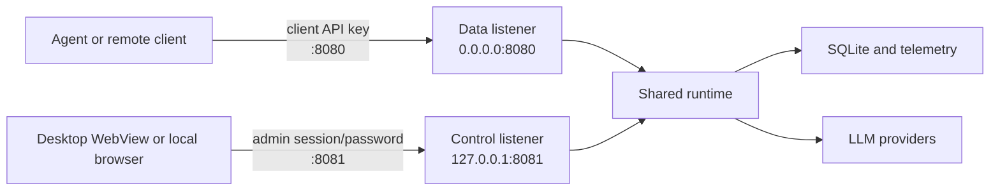

# Data-plane and Local Control-plane Listener Design

## Goal

Allow other machines to call vibe-proxy's LLM-compatible APIs without exposing
the local UI or management APIs. Implement the decision in
[ADR-0009](adr/0009-separate-data-and-control-plane-listeners.md) with a small,
testable change to the existing single-process runtime.

## User-facing configuration

```yaml
server:
  # URL shared with agents and other machines.
  listen: 0.0.0.0:8080

  # Local UI and management API. Non-loopback values are invalid.
  admin_listen: 127.0.0.1:8081

  read_timeout: 30s
  write_timeout: 0s
  idle_timeout: 120s
```

Defaults:

- `listen`: `127.0.0.1:8080`
- `admin_listen`: `127.0.0.1:8081`

Both fields are applied at process startup. Saving different listener values
through the control plane marks them as requiring restart; hot reload does not
rebind active sockets.

## Network and route topology



The runtime exposes two handler constructors:

```go
func (s *Server) DataRoutes() http.Handler
func (s *Server) ControlRoutes() http.Handler
```

They register routes independently rather than wrapping one combined mux with a
denylist. This makes absence of management routes from the public listener a
structural property. A compatibility `Routes()` helper may compose both routers
only for tests during migration, but production startup must never use it.

### Data-plane allowlist

- `GET /v1/models`
- `/v1/chat/completions`
- `/v1/responses`
- `/v1/messages`
- `/anthropic/v1/messages`
- `GET /healthz`

### Control-plane allowlist

- `/admin/*`, including the local playground bridge
- `/auth/*`
- `/desktop/bootstrap/*` when desktop sessions are enabled
- `/metrics`
- `GET /healthz`
- `/` and embedded SPA client-side routes

An unlisted path is a normal `404`. In particular, the data listener must not
fall through to the SPA.

## Configuration validation

Validation parses `admin_listen` as an IP socket address and checks:

- host is a literal loopback IP;
- port is present and valid, including `0` for tests;
- its configured port differs from the data listener port, avoiding
  wildcard/specific-address bind overlap across operating systems;
- wildcard or LAN control addresses produce an error, not a warning.

Hostnames such as `localhost` are intentionally rejected because their
resolution is environment-dependent. IPv6 loopback uses `[::1]:port`.

## Gateway lifecycle

`gatewayapp.App` owns two `http.Server` instances and two bound listeners.

Startup order:

1. load and validate configuration;
2. open SQLite and initialize telemetry;
3. construct the shared runtime;
4. bind the data listener;
5. bind the control listener;
6. attach `DataRoutes()` and `ControlRoutes()` respectively;
7. start both serve loops and report `running`.

If step 5 fails, step 4's listener is closed before SQLite/telemetry cleanup.
`Ready()` closes only after both sockets are bound.

During shutdown both servers receive the same bounded shutdown context. Shared
resources close only after both serve loops end and all tracked handlers drain.
An unexpected failure in either serve loop triggers coordinated termination so
the process cannot remain half-running with stale status.

Lifecycle status contains:

```go
type Status struct {
    State        State
    Address      string // data-plane compatibility alias
    AdminAddress string
    StartedAt    time.Time
    LastError    string
}
```

## Desktop integration

- Wails bootstraps its WebView through `App.AdminAddress()`.
- Desktop management calls use the admin base URL.
- “API endpoint” display/copy actions continue to use `App.Address()`.
- Desktop bridge status exposes both addresses with unambiguous names.
- First-run config writes both default addresses.
- Startup diagnostics identify `data_listen` versus `admin_listen` failures.

## Control-plane UX

The overview/settings surfaces show two read-only runtime endpoints:

- **API endpoint** — intended for agents; may be reachable from other machines.
- **Local management endpoint** — loopback-only; used by this application.

Editing listener values should explain that a restart is required. The initial
implementation may keep editing in raw configuration if adding a dedicated form
would delay the security boundary, but endpoint display must not label the admin
URL as the public API URL.

## Compatibility and migration

- Existing `server.listen` keeps its meaning as the LLM data-plane address.
- Missing `server.admin_listen` is defaulted to `127.0.0.1:8081` when the config
  is loaded or compiled.
- Desktop users are migrated transparently because the native host discovers
  the actual admin address.
- CLI/browser users open `http://127.0.0.1:8081` after upgrade.
- Calls to Admin APIs on the old data address receive `404`; no compatibility
  proxy or redirect is provided because that would weaken the route boundary.

## Test strategy

### Configuration

- defaulting and YAML round-trip for `admin_listen`;
- accept IPv4 and IPv6 loopback sockets;
- reject wildcard, LAN, hostname, malformed, and identical sockets.

### Routing

- every data-plane route is reachable only on `DataRoutes()`;
- every management category is absent from `DataRoutes()`;
- LLM routes are absent from `ControlRoutes()`;
- health is available on both; SPA fallback exists only on control.

### Lifecycle

- both listeners bind before readiness;
- second-bind failure closes the first listener and owned resources;
- graceful shutdown drains both listeners;
- unexpected failure of either listener terminates the whole application;
- status and startup errors identify the correct address.

### Desktop

- WebView bootstrap and management actions use the admin listener;
- API URL actions use the data listener;
- wildcard data binds never become WebView targets;
- first-run config contains both addresses.

## Implementation phases

1. Add configuration/default/validation and split runtime route builders.
2. Refactor `gatewayapp.App` to own and coordinate two listeners.
3. Adapt desktop bootstrap/status and update endpoint UI/documentation.
4. Run Go, desktop, frontend, and packaging contract tests; perform a local
   end-to-end check with public data and loopback admin addresses.

Each phase is committed after its focused tests pass.
